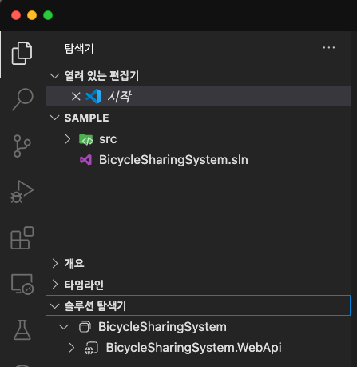
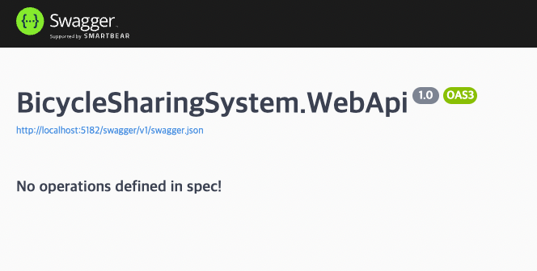

# STEP 01: ASP.NET Core 백엔드 서버 만들기

이 단계에서는 ASP.NET Core로 Backend API 서버를 만들어봅니다.

## 세션 준비 및 주의사항

1. 오늘 이 시간에는 Visual Studio Code를 이용합니다.
1. 필요한 준비 도구가 설치되지 않았다면 진행이 어려우니 꼭 [step-00](./step-00.md)에서 안내하는 도구가 올바르게 설치됐는지 확인합니다.
1. 여기서 안내하는 이름들은 가능한 바꾸지 말고 그대로 사용하시는 것을 권장합니다.

> Q. 왜 이름을 그대로 써야 하나요? 너무 길어요!

> A. 대소문자를 포함하여 문자열이 달라서 안된다고 문의주시는 분이 생각보다 꽤 많습니다. 워크샵 중간에 안되는 일이 생길 경우, 한정된 시간 중 소비되는 시간이 꽤 많이 발생하게 되는데요, 이에 저희는 이 실습을 안내대로 해보시고 여러분께서 따로 연습해보실 때 여러분들만의 이름을 사용해 보는 것을 권장하고 있습니다.


---


## 학습 목표

1. .NET 도구를 이용하여 백엔드 서버를 구성해봅니다.
1. OpenAPI 문서를 만들어봅니다.


---


## 백엔드 서버 만들기!

1. 아래 명령어를 입력하여 `BicycleSharingSystem`라는 폴더를 만들고 이동합니다.

    ```sh
    # bash, zsh or sh
    mkdir BicycleSharingSystem && cd BicycleSharingSystem
    ```

    ```powershell
    # Powershell
    New-Item -Type Directory -Path BicycleSharingSystem && Set-Location -Path BicycleSharingSystem
    ```

1. 아래 명령어를 입력하여 `Directory.Build.props` 파일을 생성합니다.

    ```sh
    dotnet new buildprops
    ```

1. 아래 명령어를 입력하여 `global.json` 파일을 생성합니다.

    ```sh
    dotnet new globaljson
    ```

1. 아래 명령어를 입력하여 `.editorconfig` 파일을 생성합니다.

    ```sh
    dotnet new editorconfig
    ```

1. 아래 명령어를 입력하여 `BicycleSharingSystem.WebApi`라는 이름으로 `WebApi` 폴더에 새 프로젝트를 생성합니다.

    ```sh
    dotnet new webapi -n "BicycleSharingSystem.WebApi" -o WebApi --use-program-main
    ```

1. 그리고 솔루션 파일을 만들고 방금 만든 프로젝트를 추가합니다.

    ```sh
    dotnet new sln -n "BicycleSharingSystem"
    dotnet sln add ./WebApi/BicycleSharingSystem.WebApi.csproj
    ```

1. 이 프로젝트에서 우리가 쓸 패키지를 추가합니다.

    ```sh
    dotnet add ./WebApi/BicycleSharingSystem.WebApi.csproj package Microsoft.Extensions.ApiDescription.Server
    dotnet add ./WebApi/BicycleSharingSystem.WebApi.csproj package Swashbuckle.AspNetCore
    ```

1. 이제 Visual Studio Code를 열고 "폴더 열기" 기능을 이용해 start 폴더를 엽니다.

1. 열린 편집기에서 아래 그림과 같이 "솔루션 탐색기"가 보이는지 확인합니다.
    * 만약 보이지 않는다면 `C# Dev Kit` 확장이 올바르게 설치가 되지 않았을 수 있습니다. 재설치를 시도해봅니다.

      

1. `Directory.Build.props` 파일을 열고 다음 내용으로 변경합니다.

    ```xml
    <Project>
        <PropertyGroup>
            <TargetFramework>net9.0</TargetFramework>
            <Nullable>enable</Nullable>
            <ImplicitUsings>enable</ImplicitUsings>
            <UseArtifactsOutput>true</UseArtifactsOutput>
            <ArtifactsPath>$(MSBuildThisFileDirectory)artifacts</ArtifactsPath>
            <OpenApiDocumentsDirectory>$(ArtifactsPath)</OpenApiDocumentsDirectory>
        </PropertyGroup>
    </Project>
    ```

1. `global.json` 파일을 열고 다음 내용으로 변경합니다.

    ```json
    {
      "sdk": {
        "allowPrerelease": false
      }
    }
    ```

1. 우리는 컨트롤러 기반의 API를 만들 것이기 때문에 `Program.cs` 파일의 `builder` 아래에 다음 줄을 추가합니다.

    ```cs
    builder.Services.AddControllers();
    ```

1. 이어서 OpenAPI의 Swagger 사용을 위해 다음 줄을 추가합니다.

    ```cs
    builder.Services.AddEndpointsApiExplorer();
    builder.Services.AddSwaggerGen();
    ```

1. 이어서 컨트롤러를 사용한다는 내용을 `app.run()` 위에 추가합니다.

    ```cs
    app.MapControllers();
    ```

1. 이어서 Swagger를 사용한다는 내용을 `app.run()` 위에 추가합니다.

    ```cs
    app.UseSwagger();
    app.UseSwaggerUI();
    ```

1. 빌드 후 바로 실행하는 것이 편하기에 `WebApi/Properties/launchSettings.json` 파을 열고 다음 내용을 수정하고 추가합니다.

    ```json
    {
        "launchBrowser": true, // 수정
        "launchUrl": "swagger" // 추가
    }
    ```

1. 다음 명령어를 사용하여 백엔드 앱이 정상 동작하는지 확인합니다.
    * 아래 이미지와 다르게 나올 수 있습니다. 페이지가 정상적으로 로드된 것만 확인해주세요.

    ```sh
    dotnet restore && dotnet watch --project WebApi
    ```

    

