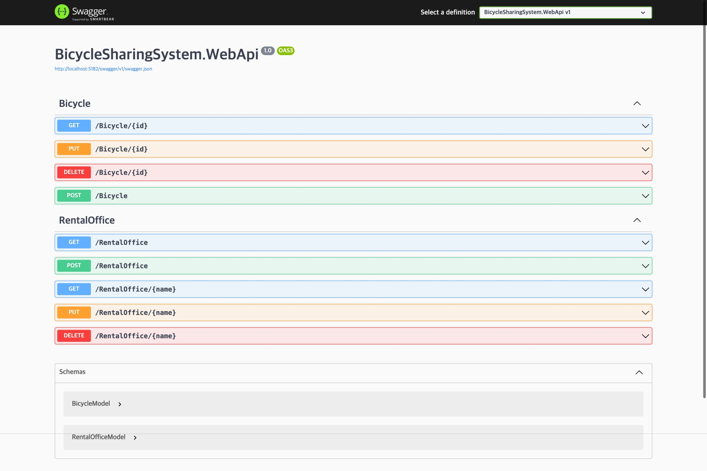

# STEP 02: 백엔드 컨트롤러와 엔드포인트 구성하기

## 학습 목표

1. 대여소와 자전거 모델을 만들어봅니다.
1. 컨트롤러와 엔드포인트를 구성해봅니다.


---


## 대여소와 자전거 모델 만들기

1. `Models`라는 이름의 새 폴더를 만듭니다.

1. 이어서 `BicycleModel.cs` 파일을 생성하고 아래 내용을 추가합니다.
    * `BicycleId` - 자전거의 ID입니다. 수동으로 지정하거나 자동으로 생성하도록 하지만 처음 한번만 설정할 수 있습니다.
    * `RentalOfficeId` - 대여소의 ID입니다.
    * `Name` - 해당 자전거의 이름입니다.
    * `StartRentalTime` - 대여 시작 시간입니다.
    * `ExpireRentalTime` - 대여 반납 시간입니다.
    * `IsRental` - 대여 중 여부입니다. 대여 시작 시간이 있으면 대여 중으로 인식합니다.

    ```cs
    public sealed class BicycleModel
    {
        [Key]
        [DatabaseGenerated(DatabaseGeneratedOption.Identity)]
        public Guid BicycleId { get; init; }

        [Required]
        public required Guid RentalOfficeId { get; set; }

        [Required]
        [MaxLength(100)]
        public required string Name { get; set; } = null!;

        public DateTime? StartRentalTime { get; set; }

        public DateTime? ExpireRentalTime { get; set; }

        public bool IsRental => StartRentalTime.HasValue;
    }
    ```

1. 이어서 `RentalOfficeModel.cs` 파일을 만들고 아래 내용을 추가합니다.
    * `OfficeId` - 대여소의 ID입니다. 수동으로 지정하거나 자동으로 생성하도록 하지만 처음 한번만 설정할 수 있습니다.
    * `Name` - 대여소의 이름입니다.
    * `Region` - 대여소의 지역입니다.
    * `Latitude` - 대여소가 있는 지역의 위도입니다.
    * `Longitude` - 대여소가 있는 지역의 경도입니다.

    ```cs
    public sealed class RentalOfficeModel
    {
        [Key]
        [DatabaseGenerated(DatabaseGeneratedOption.Identity)]
        public Guid OfficeId { get; init; }

        [Required]
        [MaxLength(100)]
        public required string Name { get; init; } = null!;

        [Required]
        [MaxLength(100)]
        public required string Region { get; init; } = null!;

        public double? Latitude { get; init; }

        public double? Longitude { get; init; }
    }
    ```


---


## 대여소와 자전거의 CRUD Controller 만들기

1. `Controllers`라는 이름의 새 폴더를 만듭니다.

1. 이어서 `BicycleController.cs` 파일을 생성하고 아래 내용을 추가합니다.

    ```cs
    [ApiController]
    [Route("[controller]")]
    public sealed class BicycleController : ControllerBase
    {
        [HttpGet("{id:guid}")]
        public BicycleModel? Get(Guid id) => default;

        [HttpPost]
        public async Task<IActionResult> Post(IEnumerable<BicycleModel> bicycles) => Ok();

        [HttpPut("{id:guid}")]
        public async Task<IActionResult> Put(Guid id, BicycleModel bicycle) => Ok();

        [HttpDelete("{id:guid}")]
        public async Task<IActionResult> Delete(Guid id) => Ok();
    }
    ```

1. 이어서 `RentalOfficeController.cs` 파일을 생성하고 아래 내용을 추가합니다.

    ```cs
    [ApiController]
    [Route("[controller]")]
    public sealed class RentalOfficeController : ControllerBase
    {
        [HttpGet]
        public IEnumerable<RentalOfficeModel> GetAll() => Enumerable.Empty<RentalOfficeModel>();

        [HttpGet("{name}")]
        public object? Get(string name) => default;

        [HttpPost]
        public async Task<IActionResult> Post(IEnumerable<RentalOfficeModel> rentalOffices) => Ok();

        [HttpPut("{name}")]
        public async Task<IActionResult> Put(string name, RentalOfficeModel updateRentalOffice) => Ok();

        [HttpDelete("{name}")]
        public async Task<IActionResult> Delete(string name) => Ok();
    }
    ```

1. 그리고 다시 빌드하여 컨트롤러와 API가 생겼는지 확인합니다.
    * 아래 이미지와 다르게 나올 수 있습니다. 여러분이 방금 추가한 API가 목록에 정상적으로 나타났는지만 확인해주세요.

    ```sh
    dotnet watch --project WebApi
    ```

    