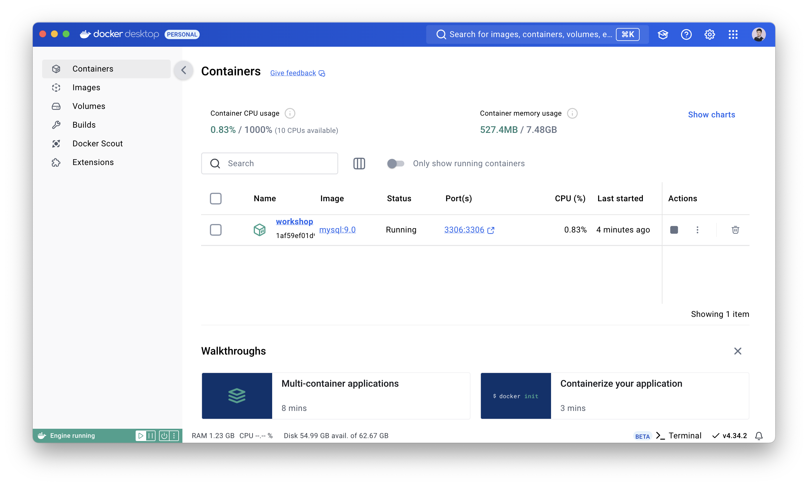
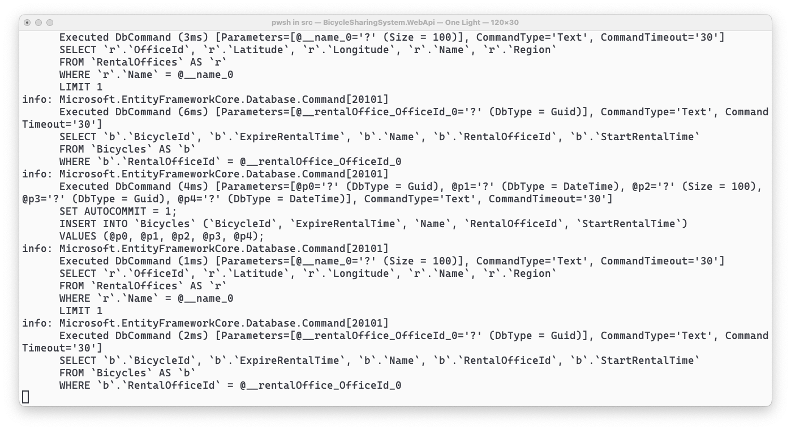

# STEP 03: MySQL 컨테이너 생성하고 연결하기

## 학습 목표

1. 백엔드 서버에 MySQL을 생성하고 연결해봅니다.


---


## MySQL 컨테이너 생성하고 연결하기

1. 다음 명령어를 입력하여 MySQL 9.0 컨테이너를 생성합니다.

    * `-d` - 백그라운드로 실행합니다.
    * `--rm` - 1회성으로 실행합니다.
    * `--name` - 컨테이너의 이름을 지정합니다.
    * `-p` - 로컬 포트와 컨테이너 포트를 연결합니다.
    * `-e` - 추가 환경변수를 설정합니다.

    ```sh
    docker run -d --rm --name workshop -p 3306:3306 -e MYSQL_ROOT_PASSWORD=1111 mysql:9.0
    ```

    

1. 다시 프로젝트가 있는 쉘 환경(터미널)으로 돌아와서 아래 명령어를 입력하여 필요한 패키지들을 설치합니다.

    * `Microsoft.EntityFrameworkCore` - 엔티티 프레임워크 라이브러리입니다.
    * `Pomelo.EntityFrameworkCore.MySql` - MySQL을 앤티티 프레임워크처럼 관리할 수 있는 라이브러리입니다.

    ```sh
    dotnet add WebApi/BicycleSharingSystem.WebApi.csproj package Microsoft.EntityFrameworkCore
    dotnet add WebApi/BicycleSharingSystem.WebApi.csproj package Pomelo.EntityFrameworkCore.MySql --version 9.0.0-preview.1
    ```

1. `Contexts`라는 이름의 폴더를 만들고 `BicycleSharingContext.cs` 파일을 생성한 뒤 다음 내용을 채워넣습니다.

    * `RentalOffices` - 대여소에 관한 엔티티 컬렉션입니다.
    * `Bicycles` - 자전거에 관한 엔티티 컬렉션입니다.

    ```cs
    public class BicycleSharingContext(DbContextOptions<BicycleSharingContext> dbContextOptions)
        : DbContext(dbContextOptions)
    {
        public DbSet<RentalOfficeModel> RentalOffices => Set<RentalOfficeModel>();

        public DbSet<BicycleModel> Bicycles => Set<BicycleModel>();

        public async Task InitializeDatabaseAsync()
        {
            await Database.EnsureCreatedAsync().ConfigureAwait(false);
        }
    }
    ```

1. `Program.cs` 파일로 이동하여 다음 내용을 추가합니다.

    ```cs
    // builder 보다 아래, app 보다 위 중 편한 곳에 위치
    var connectionString = "server=localhost;user=root;password=1111;database=workshopdb";
    var serverVersion = new MySqlServerVersion(new Version(9, 0));
    builder.Services.AddDbContext<BicycleSharingContext>(options => options.UseMySql(connectionString, serverVersion));
    ```

    ```cs
    // app 보다 아래 app.Run() 보다 위 중 편한 곳에 위치
    using (var scope = app.Services.CreateScope())
    {
        var context = scope.ServiceProvider.GetRequiredService<BicycleSharingContext>();
        Task.Run(context.InitializeDatabaseAsync);
    }
    ```

1. `RentalOfficeController.cs`로 이동하여 다음 내용을 추가합니다.

    ```cs
    [ApiController]
    [Route("[controller]")]
    public class RentalOfficeController(BicycleSharingContext context) : ControllerBase
    {
        [HttpGet]
        public IEnumerable<RentalOfficeModel> GetAll() => context.RentalOffices;

        [HttpGet("{name}")]
        public object? Get(string name)
        {
            var rentalOffice = context.RentalOffices.FirstOrDefault(o => o.Name == name);

            if (rentalOffice == null)
            {
                return default;
            }

            return new
            {
                OfficeId = rentalOffice.OfficeId,
                Name = rentalOffice.Name,
                Region = rentalOffice.Region,
                Latitude= rentalOffice.Latitude,
                Longitude = rentalOffice.Longitude,
                Bicycles = context.Bicycles.Where(x => x.RentalOfficeId == rentalOffice.OfficeId)
            };
        }

        [HttpPost]
        public async Task<IActionResult> Post(IEnumerable<RentalOfficeModel> rentalOffices)
        {
            try
            {
                context.RentalOffices.AddRange(rentalOffices);

                var changes = await context.SaveChangesAsync().ConfigureAwait(false);

                return Ok(changes);
            }
            catch (Exception ex)
            {
                return StatusCode(StatusCodes.Status500InternalServerError, ex.Message);
            }
        }

        [HttpPut("{id:guid}")]
        public async Task<IActionResult> Put(Guid id, RentalOfficeModel updateRentalOffice)
        {
            var rentalOffice = context.RentalOffices.FirstOrDefault(o => o.OfficeId == id);

            if (rentalOffice is null)
            {
                return NotFound($"\"{id}\" cannot be found.");
            }

            try
            {
                context.RentalOffices.Remove(rentalOffice);
                context.RentalOffices.Add(updateRentalOffice);

                return await context.SaveChangesAsync().ConfigureAwait(false) > 0
                    ? Accepted()
                    : StatusCode(StatusCodes.Status500InternalServerError);
            }
            catch (Exception ex)
            {
                return StatusCode(StatusCodes.Status500InternalServerError, ex.Message);
            }
        }

        [HttpDelete("{id:guid}")]
        public async Task<IActionResult> Delete(Guid id)
        {
            var previousOffice = context.RentalOffices.FirstOrDefault(o => o.OfficeId == id);

            if (previousOffice is null)
            {
                return NotFound($"\"{id}\" cannot be found.");
            }

            try
            {
                context.RentalOffices.Remove(previousOffice);

                return await context.SaveChangesAsync().ConfigureAwait(false) > 0
                    ? Accepted()
                    : StatusCode(StatusCodes.Status500InternalServerError);
            }
            catch (Exception ex)
            {
                return StatusCode(StatusCodes.Status500InternalServerError, ex.Message);
            }
        }
    }
    ```

1. `BicycleController.cs`로 이동하여 다음 내용을 추가합니다.

    ```cs
    [ApiController]
    [Route("[controller]")]
    public class BicycleController(BicycleSharingContext context) : ControllerBase
    {
        [HttpGet("{id:guid}")]
        public BicycleModel? Get(Guid id) => context.Bicycles.FirstOrDefault(b => b.BicycleId == id);

        [HttpPost]
        public async Task<IActionResult> Post(IEnumerable<BicycleModel> bicycles)
        {
            try
            {
                context.Bicycles.AddRange(bicycles);

                var changes = await context.SaveChangesAsync().ConfigureAwait(false);

                return Ok(changes);
            }
            catch (Exception ex)
            {
                return StatusCode(StatusCodes.Status500InternalServerError, ex.Message);
            }
        }

        [HttpPut("{id:guid}")]
        public async Task<IActionResult> Put(Guid id, BicycleModel bicycle)
        {
            var dbBicycle = context.Bicycles.FirstOrDefault(x => x.BicycleId == id);

            if (dbBicycle is null)
            {
                return NotFound(bicycle);
            }

            try
            {
                context.Bicycles.Remove(dbBicycle);
                context.Bicycles.Add(bicycle);

                return await context.SaveChangesAsync().ConfigureAwait(false) > 0
                    ? Accepted()
                    : StatusCode(StatusCodes.Status500InternalServerError);
            }
            catch (Exception ex)
            {
                return StatusCode(StatusCodes.Status500InternalServerError, ex.Message);
            }
        }

        [HttpDelete("{id:guid}")]
        public async Task<IActionResult> Delete(Guid id)
        {
            var dbBicycle = context.Bicycles.FirstOrDefault(x => x.BicycleId == id);

            if (dbBicycle is null)
            {
                return NotFound(id);
            }

            try
            {
                context.Bicycles.Remove(dbBicycle);

                return await context.SaveChangesAsync().ConfigureAwait(false) > 0
                    ? Accepted()
                    : StatusCode(StatusCodes.Status500InternalServerError);
            }
            catch (Exception ex)
            {
                return StatusCode(StatusCodes.Status500InternalServerError, ex.Message);
            }
        }
    }
    ```

1. 다음 명령어를 이용하여 실행 후 Swagger UI를 통해 데이터 추가/제거가 잘 동작하는지 확인해봅니다.
잘 동작한다면 아래 그림처럼 API 조회 시 쿼리가 동작하는 모습을 볼 수 있습니다.

   ```sh
   dotnet watch --project WebApi
   ```

   

1. 이제 대여와 반납을 할 수 있는 사용자의 API 컨트롤러를 만들어봅니다.
먼저 `Controllers` 폴더에 `UserController.cs` 파일을 생성하고 다음 내용을 채워넣습니다.

    * 대여는 자전거 ID와 대여할 시간을 파라미터로 받습니다.
      * 만약 받지 못했다면 기본값인 `DefaultRentalTime`으로 적용합니다.
    * 반납은 자전거 ID와 반납 장소의 ID를 파라미터로 받습니다.

    ```cs
    [ApiController]
    [Route("[controller]")]
    public class UserController(BicycleSharingContext context) : ControllerBase
    {
        private const int DefaultRentalTime = 1;

        [HttpPut("Rental/{id:guid}/{time:int?}")]
        public async Task<IActionResult> RentalAsync(Guid id, int time = DefaultRentalTime)
        {
            var dbBicycle = context.Bicycles.FirstOrDefault(x => x.BicycleId == id);

            if (dbBicycle is null)
            {
                return BadRequest();
            }

            var startDateTime = DateTime.Now;
            var expireDateTime = startDateTime + TimeSpan.FromMinutes(time);

            dbBicycle.StartRentalTime = startDateTime;
            dbBicycle.ExpireRentalTime = expireDateTime;

            return await context.SaveChangesAsync().ConfigureAwait(false) > 0
                ? Accepted()
                : StatusCode(StatusCodes.Status500InternalServerError);
        }

        [HttpPut("Return/{officeId:guid}/{bicycleId:guid}")]
        public async Task<IActionResult> ReturnAsync(Guid officeId, Guid bicycleId)
        {
            var dbBicycle = context.Bicycles.FirstOrDefault(x => x.BicycleId == bicycleId);

            if (dbBicycle is null)
            {
                return BadRequest();
            }

            dbBicycle.RentalOfficeId = officeId;
            dbBicycle.StartRentalTime = default;
            dbBicycle.ExpireRentalTime = DateTime.Now;

            return await context.SaveChangesAsync().ConfigureAwait(false) > 0
                ? Accepted()
                : StatusCode(StatusCodes.Status500InternalServerError);
        }
    }
    ```

1. 다음 명령어를 입력하여 잘 동작하는지 확인합니다.

    ```sh
    dotnet watch --project WebApi
    ```
