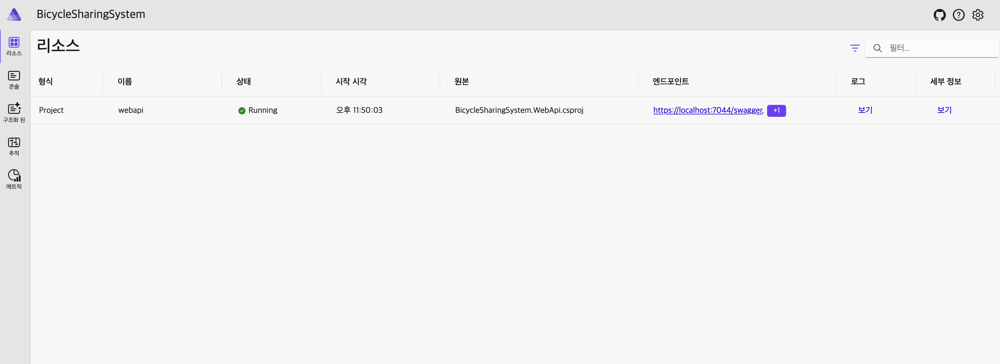
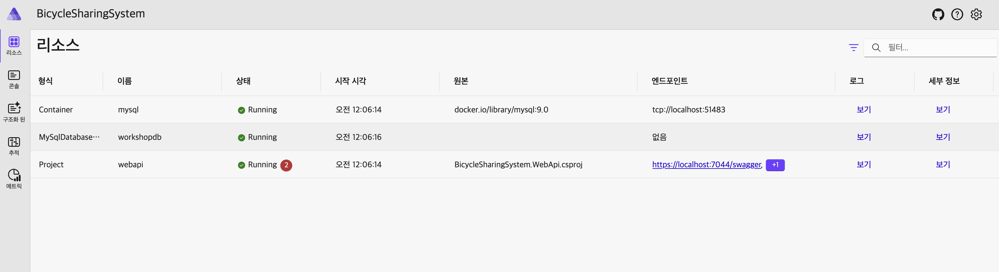

# STEP 04: .NET Aspire 시작하기

## 학습 목표

1. 로컬에서 .NET Aspire 환경을 구성해봅니다.


---


## .NET Aspire 시작하기

* 지금까지 우리는 DB 서버를 신경쓰면서 백엔드를 개발해야 했습니다.
* DB의 계정과 비밀번호 그리고 DB 이름을 결합한 ConnectionString도 입력해야 했죠.
* 또한 백엔드를 테스트하기 전 컨테이너의 매번 초기화하거나 실행을 필요로 했습니다.

그럴 때 .NET Aspire가 빛을 발합니다!

> ⚠️ 여기서부터는 프로젝트 이름이 서로 비슷합니다.
> 같은 파일이라도 햇갈리지 않게 주의가 필요합니다.

1. 다음 명령어를 입력하여 워크로드를 설치합니다.

    * Windows
        ```sh
        dotnet workload install aspire
        ```
    * Linux, macOS
        ```sh
        sudo dotnet workload install aspire
        ```

1. 이어서 다음 명령어를 이용하여 AppHost와 ServiceDefaults 프로젝트를 만들고 솔루션에 추가합니다.

    * `aspire-apphost` - Aspire의 시작 프로젝트입니다. 이제 모든 것은 여기서 관리하고 시작합니다.
    * `aspire-servicedefaults` - Aspire의 기본 서비스 설정 프로젝트입니다. Health Check와 같은 기본 설정이 여기에 있습니다.

    ```sh
    dotnet new aspire-apphost -n "BicycleSharingSystem.AppHost" -o AppHost
    dotnet new aspire-servicedefaults -n "BicycleSharingSystem.ServiceDefaults" -o ServiceDefaults

    dotnet sln add ./AppHost/BicycleSharingSystem.AppHost.csproj
    dotnet sln add ./ServiceDefaults/BicycleSharingSystem.ServiceDefaults.csproj
    ```

1. 조금 전 만든 `ServiceDefaults` 프로젝트를 `WebApi` 프로젝트에 연결합니다.

    ```sh
    dotnet add WebApi/BicycleSharingSystem.WebApi.csproj reference ServiceDefaults/BicycleSharingSystem.ServiceDefaults.csproj
    ```

1. `BicycleSharingSystem.WebApi`의 `Program.cs` 파일에서 방금 추가한 서비스 기본값을 추가합니다.

    ```cs
    // builder 아래 app 위 중 자유롭게 추가
    builder.AddServiceDefaults();
    ```

1. 이제 `WebApi`를 `AppHost`에 추가합니다.

    ```sh
    dotnet add AppHost/BicycleSharingSystem.AppHost.csproj reference WebApi/BicycleSharingSystem.WebApi.csproj
    ```

1. `BicycleSharingSystem.AppHost`의 `Program.cs` 파일에서 방금 추가한 API 프로젝트를 추가합니다.

    ```cs
    // builder 아래, builder.Build().Run() 위 중 자유롭게 추가
    builder.AddProject<BicycleSharingSystem_WebApi>("webapi");
    ```

1. 이제 Aspire의 기본 구성이 끝났습니다! 다음 명령어를 이용해 잘 동작하는지 확인합니다.

    ```sh
    dotnet watch --project AppHost
    ```

    


---


## .NET Aspire에 MySQL 관리하도록 만들기

이전까지는 Aspire의 기본 설정만 했었기 때문에 뭐가 좋은지 체감하지 못하셨을거에요.

이제 진짜를 만나러 가 봅니다!

> ⚠️ 여기서부터는 프로젝트 이름이 서로 비슷합니다.
> 같은 파일이라도 햇갈리지 않게 주의가 필요합니다.

1. AppHost에 Aspire 호스트용 MySQL 도구를 설치합니다.

    ```sh
    dotnet add AppHost/BicycleSharingSystem.AppHost.csproj package Aspire.Hosting.MySql
    ```

1. `BicycleSharingSystem.AppHost`의 `Program.cs` 파일에서 다음 내용을 수정합니다.

    * Aspire에게 `MySQL`을 사용할 것임을 알립니다. 이때 인스턴스의 이름이 `mysql` 입니다.
    * Aspire에게 `MySQL`에 `workshopdb`라는 데이터베이스를 하나 존대한다고 알립니다.
    * 이렇게 만든 `mysql` 인스턴스를 백엔드 앱에 참조시켜 백엔드가 `MySQL`을 사용할 것임을 알립니다.

    ```cs
    var mysql = builder.AddMySql("mysql").AddDatabase("workshopdb");

    // builder.AddProject<BicycleSharingSystem_WebApi>("webapi");
    builder.AddProject<BicycleSharingSystem_WebApi>("webapi")
           .WithReference(mysql);
    ```

1. WebApi에 Aspire 소비자용 MySQL 도구를 설치합니다.

    ```sh
    dotnet add WebApi/BicycleSharingSystem.WebApi.csproj package Aspire.Pomelo.EntityFrameworkCore.MySql
    ```

1. `BicycleSharingSystem.WebApi`의 `Program.cs` 파일에서 다음 내용을 수정합니다.

    ```cs
    // var connectionString = "server=localhost;user=root;password=1111;database=workshopdb";
    // var serverVersion = new MySqlServerVersion(new Version(9, 0));
    // builder.Services.AddDbContext<BicycleSharingContext>(options => options.UseMySql(connectionString, serverVersion));
    builder.AddMySqlDbContext<BicycleSharingContext>("workshopdb");
    ```


1. 이제 Aspire의 개발 구성이 끝났습니다! 다음 명령어를 이용해 잘 동작하는지 확인합니다.

    * ConnectionString 구상할 필요도, 도커 구성할 필요도 없이 바로 실행됩니다.
    * MySQL 뿐만 아니라 Redis 캐시 등 여러 모듈이 있는 경우 훨씬 편하게 개발환경을 구성할 수 있습니다.

    ```sh
    dotnet watch --project AppHost
    ```

    